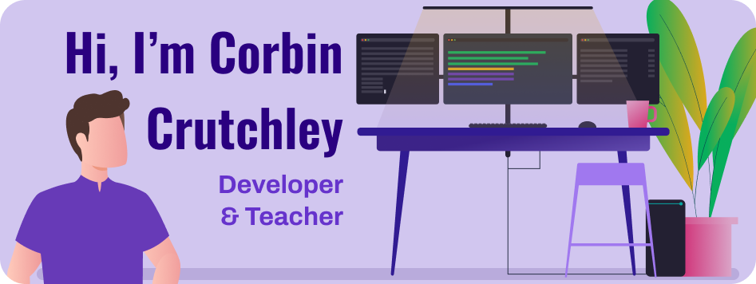
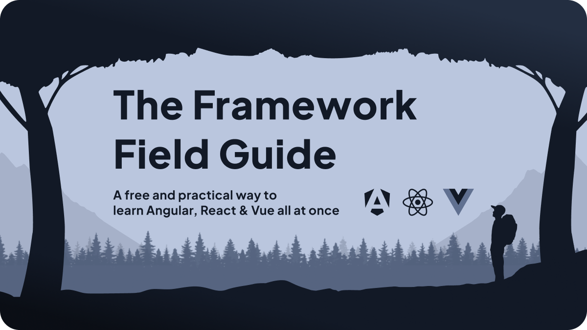

Hi there! I'm Corbin: A Staff Frontend Developer, [GitHub Star](https://stars.github.com/profiles/crutchcorn/), developer, and teacher. This is my profile page to outline some of the things I'm working on today.

<h1>📚 Content</h1>

I've created a wide array of forms of content. I'm passionate about communication between developers and want to do my best to enhance the learning experience that other developers experience.

<h2>✍️ Writing</h2>

I've written 100K+ words on a wide range of programming topics. Among them are:

- [50+ articles for the blog, Unicorn Utterances](https://crutchcorn.dev)
- [What is Aggregation in MongoDB?](https://www.mongodb.com/basics/aggregation)
- [Add SMS Verification to React Native App Using Node.js and Express](https://developer.vonage.com/blog/2020/05/26/add-sms-verification-in-a-react-native-app-using-node-js-and-express-dr)
- [Integrating Shoelace with NextJS](https://next.shoelace.style/tutorials/integrating-with-nextjs)
- [HERE Map's React Tutorial](https://developer.here.com/tutorials/react)

I'm also writing a book trilogy called "The Framework Field Guide", which will teach React, Angular, and Vue all in one book! Click on the image below to learn more:

<h2>📷 Video</h2>

On top of a [small foray into TikTok](https://www.tiktok.com/@crutchcorn/video/7083240403318721838), [I'm a Twitch affiliate with over 1,500 followers](https://twitch.tv/crutchcorn). I stream regularly, often 6-8 hours a week, every week.

I do my best to engage with the community as much as possible, and have continued to host [charity Livestream events](https://theframedrops.com/), where we've even previously garnered $3k for charity!

I also host a [Discord community for others on Twitch to be able to talk to me](https://discord.gg/FMcvc6T) and do pair-progamming in office hours in order to help solve some of their problems. 

 

<h2>🗣️ Talks</h2>

I've spoken at various conferences about a wide range of programming topics. Among them include:

- ["React 19 for the Rest of Us" at React Rally 2024](https://www.youtube.com/watch?v=zvSvBMljkZ8)
- ["Learn Angular Signals By Writing Your Own" at ngConf 2024](https://www.youtube.com/watch?v=cJ7AuQUBmA4)
- ["How Does Git Work Under The Hood" at GitKon](https://www.gitkraken.com/gitkon/how-does-git-work-under-the-hood)
- ["Using ColdFusion APIs in Expo Mobile Apps" at Adobe ColdFusion Developer Week 2021](https://web.archive.org/web/20210621181857/https://adobe.vconfex.com/site/adobe-coldfusion-developer-week/977)

I've also spoken at more than a dozen smaller meetups. Some of the earliest meetups I'd done were:

- ["Smooth Sailing with Angular" at SacJS](https://www.meetup.com/The-Sacramento-Javascript-Meetup/events/247295930/)
- ["Reeling You In On React Hooks" at SacJS](https://github.com/sacjs/website/issues/130)
- ["Using Slack API for App Integrations" at Slack Sacramento Meetup](https://slackcommunity.com/events/details/slack-sacramento-presents-building-communities-and-slack-api-integrations/)
- ["Angular Templates — From Start to Source" at GDG Sacramento](https://www.meetup.com/gdgsacramento/events/tgxqkqyxqbrb/)
- ["Blogging with Gatsby: An Introduction to Gatsby"](https://www.tracydevs.com/2020/04/blogging-with-gatsby-introduction-to-gatsby/)

<h2>🎙️ Podcasts</h2>

I've done a bit  of podcasting to talk about web development:

- [CodingCat Podcast: WebDev Fundamentals | React, Angular, and Vue](https://codingcat.dev/podcast/webdev-fundamentals-or-react-angular-and-vue)
- [Syntax.fm EP752: React vs Vue vs Angular with Corbin Crutchley](https://syntax.fm/show/752/react-vs-vue-vs-angular-with-corbin-crutchley)
- [The Angular Plus Show S3 E7: Your Frameworks Field Guide with Corbin Crutchley](https://open.spotify.com/episode/6bjuGf0wSDuZ9MopP7SpzJ)
- [devtools.fm EP65: Framework Field Guide (learn React, Angular, Vue at the same time)](https://www.devtools.fm/episode/65)
- [Web Rush EP215: How I Doubled by Lighthouse Performance with Astro.js with Corbin Crutchley](https://webrush.io/episodes/episode-215-how-i-doubled-by-lighthouse-performance-with-astrojs-with-corbin-crutchley)
- [Web Rush EP201: Web Framework Field Guide with Corbin Crutchley](https://webrush.io/episodes/episode-201-web-framework-field-guide-with-corbin-crutchley)
- [Compressed.fm EP80: Learning Frontend Frameworks Better with Corbin Crutchley](https://www.compressed.fm/episode/80)
- [20minJS EP25: Learning UI frameworks with Corbin Crutchley](https://podcast.20minjs.com/1952066/11179009-episode-25-learning-ui-frameworks-with-corbin-crutchley)
- [TPDP E37: Writing Tests in a Development Project](https://www.thepolyglotdeveloper.com/2020/06/tpdp-e37-writing-tests-development-project/)
- [TPDP E32: Getting Familiar with TypeScript for Development](https://www.thepolyglotdeveloper.com/2019/10/tpdp-e32-getting-familiar-typescript-development/)
- [TPDP EP29: Asynchronous JavaScript Development](https://www.thepolyglotdeveloper.com/2019/07/tpdp-e29-asynchronous-javascript-development/)

> I'd love to be in **your** podcast! Please [reach out to me on Twitter](https://twitter.com) if you think I'd be a good guest on your show!

<h1>👨‍💻 Code</h1>

On top of contributing to tons of open-source projects, I also help maintain:

- 🦄 [Unicorn Utterances](https://github.com/unicorn-utterances/)
- 🖍️ [Jimp](https://github.com/jimp-dev/)
- 💧 [PlopJS](https://github.com/plopjs/)
- 📝 [TanStack Form](https://tanstack.com/form)
- 🏪 [TanStack Store](https://tanstack.com/store)
- 🔨 [TanStack Config](https://tanstack.com/config)
- ⚛️ [Redux Angular](https://github.com/reduxjs/angular-redux)
- ⚛️ [Redux Vue](https://github.com/reduxjs/vue-redux)
- 🎨 [Node Vibrant](https://github.com/Vibrant-Colors/)
- 🐨 [CLI Testing Library](https://github.com/crutchcorn/cli-testing-library)
- 🤳 [React Native Responsive UI](https://github.com/oceanbit/react-native-responsive-ui)
- 🍫 [React Native Immersive Bars](https://github.com/oceanbit/react-native-immersive-bars)
- 🔷 [TS Util Helpers](https://github.com/crutchcorn/ts-util-helpers)

<h1>🧑‍🤝‍🧑 Socials</h1>

- 🐣 [Twitter](https://twitter.com/crutchcorn)
- 💜 [Discord](https://discord.com/invite/FMcvc6T)
- 💼 [LinkedIn](https://www.linkedin.com/in/corbincrutchley/)
- 🖼️ [Instagram](https://www.instagram.com/crutchcorn/)
- 🧵 [Threads](https://www.threads.net/@crutchcorn)
- 🔵 [BlueSky](https://bsky.app/profile/crutchcorn.dev)
